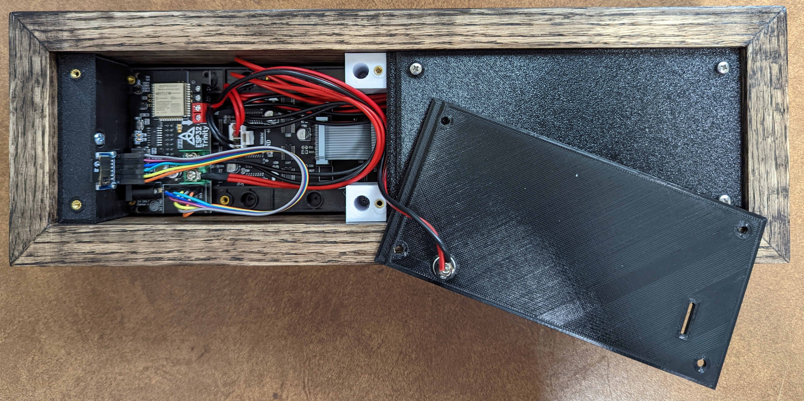
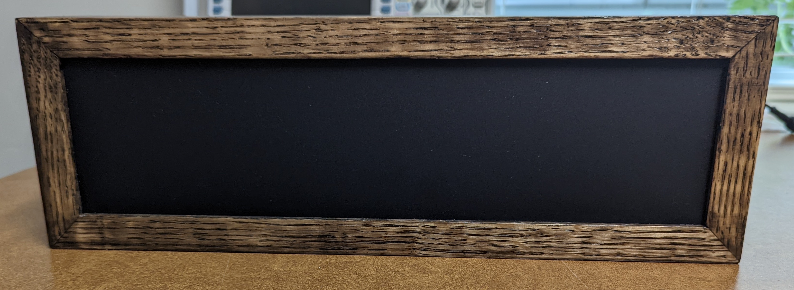
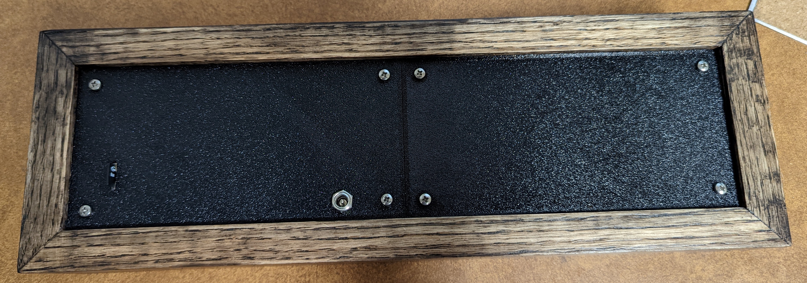
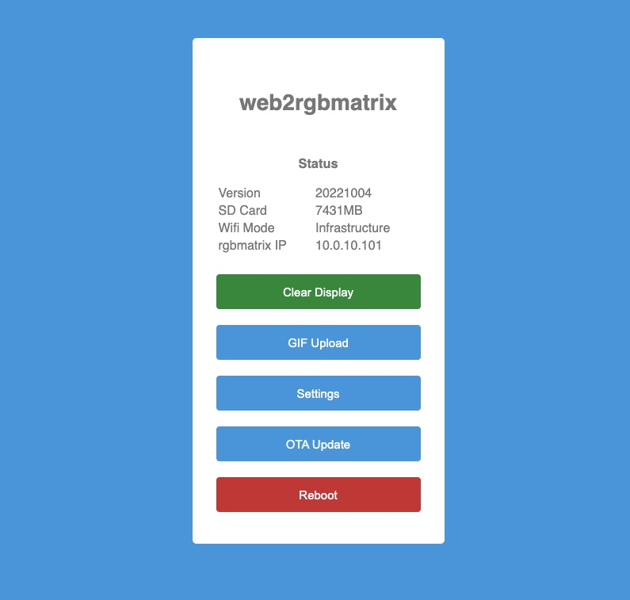
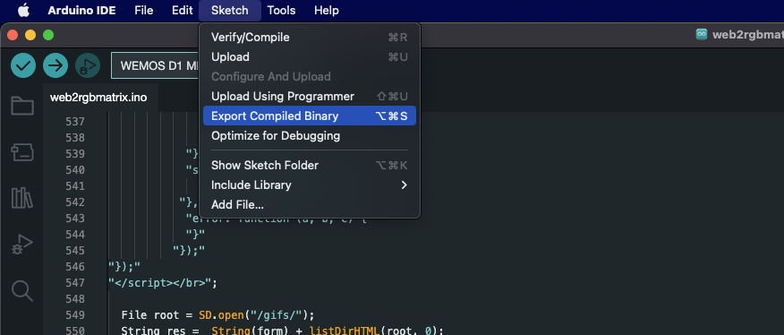

# web2rgbmatrix
[MiSTer_web2rgbmatrix](https://github.com/kconger/MiSTer_web2rgbmatrix) is an hardware and software addon for the [MiSTer FPGA](https://github.com/MiSTer-devel) that displays an animated or static GIF logo of the current running [MiSTer FPGA](https://github.com/MiSTer-devel) core on an RGB LED Matrix.


Current features
-------
- Display active MiSTer Core logo, or MENU.gif if not avilable.
- Store GIFs on an SD Card or on the MiSTer, storing on the MiSTer introduces a delay due to the transfer.
- Turns off the display if requesting client is off for 1 minute
- Displays network and SD card status at boot for 1 minute
- Web: Status display of Wifi, SD Card, loaded GIF, and connected client IP
- Web: Wifi Configuration 
- Web: GIF uploads to SD Card
- Web: OTA updates
- Serial debug output

Requirements
-------
Hardware
- [ESP32 Trinity](https://esp32trinity.com/) or other ESP32 with WiFi
- (2) 64x32 HUB75 compatible RGB matrix or matrices. [ie.](https://www.aliexpress.com/item/3256801502846969.html)
- SD Card module(optional) [ie.](https://www.amazon.com/dp/B08CMLG4D6?psc=1&ref=ppx_yo2ov_dt_b_product_details)
- SD Card(optional), any size, the one that came with the DE10-Nano works great
- 5V Power Supply, the one that came with the DE10-Nano works great

Software
- Arduino IDE
- ESP32 Board Support Package
- Library Dependencies: AnimatedGIF, ArduinoJson, ESP32-HUB75-MatrixPanel-I2S, ESP32Ping

Install
-------
**ESP32 Setup**

Flash the Arduino sketch to the EXP32-Trinity using Arduino IDE. If using another ESP32 board you may need to adjust pin assignments in the ino file.

**rgbmatrix SD Card Setup**

Format an SD card as FAT and create a folder called "gifs" at its root.  To start you can copy the static GISs included into that "gifs" folder.  The [tty2rgbmatrix](https://github.com/h3llb3nt/tty2rgbmatrix) project has a nice set of animated GIFs you can use as well.
GIFs must be 128x32px and the file names must match the core name exactly, ie. Minimig.gif

**Assembly**

Wiring should look like the following and the enclosure is up to you.  I used some 1x3" red oak, 330x90x3mm [matte diffusing acrylic](https://www.tapplastics.com/product/plastics/cut_to_size_plastic/black_led_sheet/668) and some 3D printed parts I designed..




**rgbmatrix Setup**

Initially, the rgbmatrix starts up in AP mode with an SSID of "rgbmatrix" and the password "password".  Once connected to its SSID go to http://rgbmatrix.local/ in your web browser and configure the wifi client to connect to your Wifi infrastructure.

If using the rgbmatrix in Wifi infrastructure mode, you'll want to create a DHCP reservation on your DHCP server so that your IP doesn't change. Add this IP to the "HOSTNAME" variable in the web2rgbmatrix.conf file on the MiSTer.



**MiSTer Setup**

Copy linux/web2rgbmatrix folder to root of your MiSTer_Data partition. ie. /media/fat/web2rgbmatrix

Add the following to the bottom of MiSTer_Data/linux/user-startup.sh

```
/media/fat/web2rgbmatrix/S60web2rgbmatrix start
```

Modify your "web2rgbmatrix.conf" to include your rgbmatrix IP address or hostname. MiSTer does not support MDNS resolution.

**Test**

After configuring your MiSTer and rgbmatrix, reboot both of them and test by changing cores.

OTA Updates
-------
To build a OTA update file, use "Sketch"-->"Export Compiled Binary" menu option in the Arduino IDE.  The resulting "web2rgbmatrix.ino.bin" file will be under the build folder within the project folder.




Credits
-------
Inspired by the [tty2rgbmatrix](https://github.com/h3llb3nt/tty2rgbmatrix) and [MiSTer_tty2oled](https://github.com/venice1200/MiSTer_tty2oled) projects.

Linux/MiSTer service code from the [MiSTer_tty2oled](https://github.com/venice1200/MiSTer_tty2oled) with minor modifications.

Most GIFS sourced from [the pixelcade art repo](https://github.com/alinke/pixelcade)
