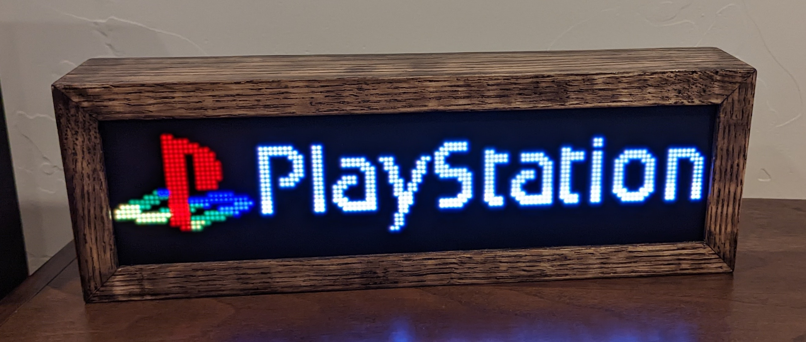

# web2rgbmatrix
[web2rgbmatrix](https://github.com/kconger/MiSTer_web2rgbmatrix) is a wireless arcade marquee with a web based management UI and some other cool features.

Current Features
-------
- Matrix: Display animated or static GIFs from SD card or by HTTP POST 
- Matrix: Display text by request
- Matrix: [Screen Savers](docs/ScreenSavers.md): Blank, [Tetris Clock](docs/images/matrix-tetrisclock.gif), [Plasma](docs/images/matrix-plasma.gif), [Starfield](docs/images/matrix-starfield.gif), and [Toasters](docs/images/matrix-toasters.gif)
- Web: Display status of Wifi, SD Card, loaded GIF, settings and connected client
- Web: Settings for Wifi, matrix text color, matrix brightness, screen saver, and client timeout 
- Web: SD Card File Browser with upload support
- Web: OTA updates
- Web: HTTP calls for scripting
- FTP: FTP Server for SD card file management
- Serial: [MiSTer_tty2x](https://github.com/venice1200/MiSTer_tty2x) service support, requires GIFs installed on rgbmatrix SD Card
- Serial: Debug output
- MiSTer/RetroPie: [MiSTer FPGA](https://github.com/MiSTer-devel) Linux service that displays an animated and/or static GIF logo of the current running core.
- MiSTer/RetroPie: Text fallback for missing GIFs
- MiSTer/RetroPie: Store GIFs on system, storing on the requesting system introduces a playback delay due to the transfer
- MiSTer/RetroPie: Update Script

Requirements
-------
**Hardware**

- [ESP32-Trinity](https://esp32trinity.com/) or similar device
- (2) 64x32 HUB75 compatible RGB matrix or matrices. [ie.](https://www.aliexpress.com/item/3256801502846969.html)
- SD Card module(optional) [ie.](https://www.amazon.com/dp/B08CMLG4D6?psc=1&ref=ppx_yo2ov_dt_b_product_details)
- SD Card(optional), any size, the one that came with the DE10-Nano works great
- 5V Power Supply, the one that came with the DE10-Nano works great

**Software**

- [Arduino IDE 2.0+](https://www.arduino.cc/en/software)
- ESP32 Board Support Package 2.0+
- Library Dependencies: [AnimatedGIF](https://github.com/bitbank2/AnimatedGIF), [ArduinoJson](https://github.com/bblanchon/ArduinoJson), [ESP32-HUB75-MatrixPanel-I2S](https://github.com/mrfaptastic/ESP32-HUB75-MatrixPanel-I2S-DMA), [ESP32FTPServer](https://github.com/schreibfaul1/ESP32FTPServer), [ESP32Ping](https://github.com/marian-craciunescu/ESP32Ping), [ezTime](https://github.com/ropg/ezTime), [FastLED](https://github.com/FastLED/FastLED), [SdFat](https://github.com/greiman/SdFat), [TetrisAnimation](https://github.com/toblum/TetrisAnimation)

**Marquee Art**

- 128x32 resolution [Marquee GIFs](https://github.com/h3llb3nt/marquee_gifs) pack

Documentation
-------
**[Assembly](docs/Assembly.md)**

**[Install & Setup](docs/Install.md)**

**[Configuration](docs/Configuration.md)**

**[MiSTer Setup](linux/README.md)**

**[RetroPie/Emulationstation Setup](emulationstation/README.md)**

**[API](docs/API.md)**

Credits
-------
Inspired by the [tty2rgbmatrix](https://github.com/h3llb3nt/tty2rgbmatrix) and [MiSTer_tty2oled](https://github.com/venice1200/MiSTer_tty2oled) projects.

Linux/MiSTer service code and update scripts from the [MiSTer_tty2oled](https://github.com/venice1200/MiSTer_tty2oled) project with modifications.

Plasma animation code from [here](https://github.com/mrfaptastic/ESP32-HUB75-MatrixPanel-I2S-DMA/blob/master/examples/2_PatternPlasma/2_PatternPlasma.ino).

Starfield animation code from [here](https://github.com/sinoia/oled-starfield)

Tetris Clock code from [here](https://github.com/witnessmenow/ESP32-Trinity/tree/master/examples/Projects/WifiTetrisClock)

Toast animation code from [here](https://learn.adafruit.com/animated-flying-toaster-oled-jewelry/code)
