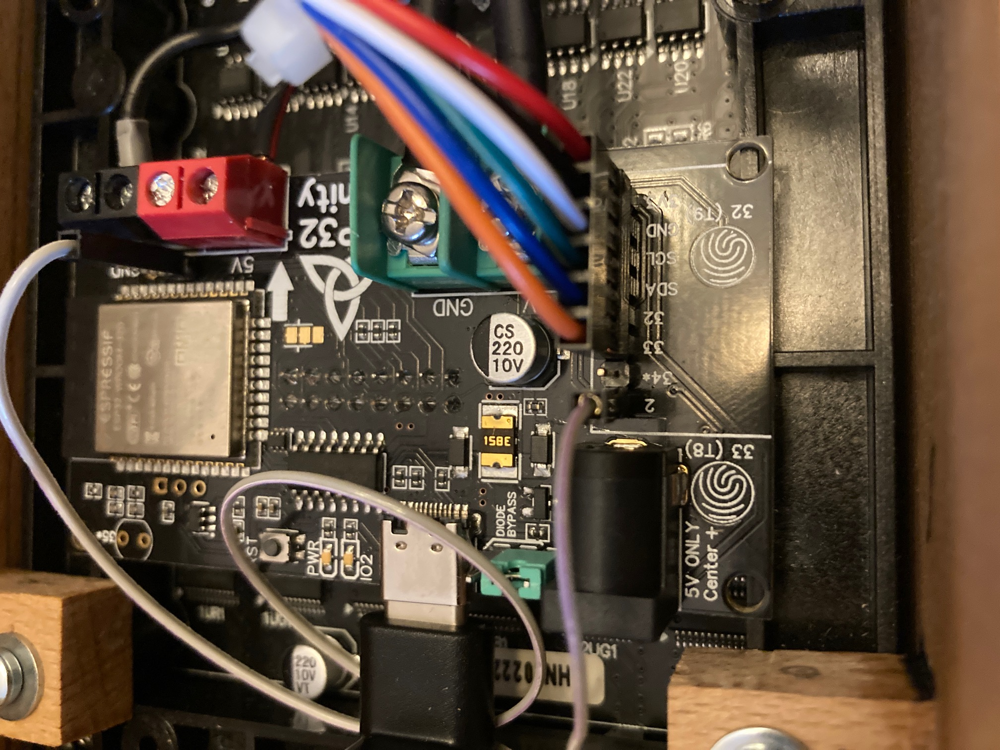

# Assembly Details

The rgbmatrix pictured in this repo was built using the following materials.

- 1x3"x6' of red oak 
- 330x90x3mm matte diffusing acrylic from [here](https://www.tapplastics.com/product/plastics/cut_to_size_plastic/black_led_sheet/668)
- 12x M3x5mm pan head screws
- 3D printed parts in this folder: [models](models/)
- 8x M3 brass heat set inserts for 3D printed parts
- [ESP32-Trinity](https://esp32trinity.com/) 
- (2) 64x32 HUB75 compatible RGB matrix from [here](https://www.aliexpress.com/item/3256801502846969.html)
- SD Card module from [here](https://www.amazon.com/dp/B08CMLG4D6?psc=1&ref=ppx_yo2ov_dt_b_product_details)
- 8GB SD Card that came with the DE10-Nano
- 5V Power Supply that came with the DE10-Nano

Once assembled the wiring should look like the following.

If using different panels and your green and blue matrix colors are swapped, attach pin 2 to ground. See below.

