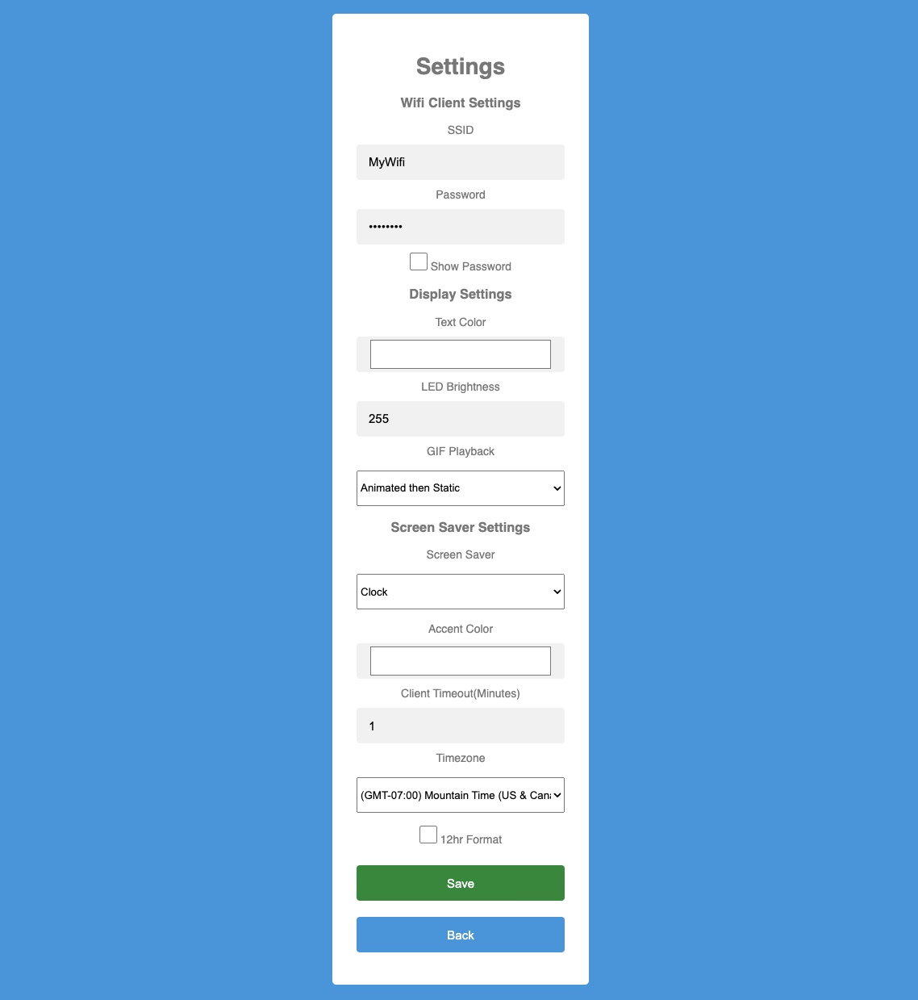

# Configuration

Web Interface
-------
The rgbmatrix web interface allows for full configuration of the rgbmatrix.  Options can be seen in the following screen shots.

**Main Page**


**Settings Page**




HTTP Calls
-------
The rgbmatrix web interface also provides some handy HTTP calls that can be used to create your own scripts.


**GET**

Clear rgbmatrix: 

```curl http://rgbmatrix.local/clear```

Display Line of Text:

```curl http://rgbmatrix.local/text?line=TextString```

Display GIF from SD:

```curl http://rgbmatrix.local/localplay?file=MENU```

Get Version

```curl http://rgbmatrix.local/version```

Reboot

```curl http://rgbmatrix.local/reboot```

**POST**

Transfer and Display GIF

```curl -F 'file=@file.gif' http://rgbmatrix.local/remoteplay```

FTP Interface
-------
The rgbmatrix runs a very simple FTP server that can be used to manage the SD card.  Your FTP client must be set to only use 1 connection, username to "rgbmatrix" and the password to "password".